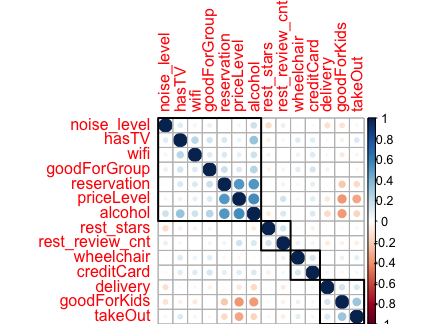

# Preliminary Analysis of Restaurant Recommendation System

## Introduction
We explored the [Yelp Open dataset](https://www.yelp.com/dataset). Using the dataset, we built a relational database and a predicting model for the GoodForKids attribute. We also performed the clustering analysis to the user dataset.

## Authors
* Shih-Ting Huang 
* Sukraat Ahluwalia
* Guangze Jin

## Poster

## Analysis

* Correlation matrix between all attributes.

* Predicting model results

| Algorithm | Training | Validation | Testing |
| :---:  | :---: | :---: | :---: |
| Decision Tree | 14.6% | 14.3% | 13.9%|
| Random Forest | 13.2% | 13.8% | 14.6% |
| SVM | 13.6% | 13.2% | 14.7%|

* User clustering 
